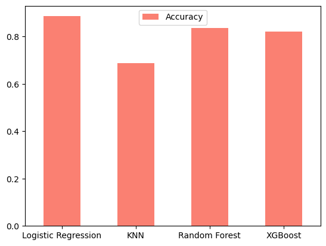

# End-to-End Heart Disease Classification Project

Welcome to the "End-to-End Heart Disease Classification" project! This project delves into the realm of machine learning to predict heart disease based on crucial clinical parameters.

Whether you're a data science enthusiast or a healthcare professional, this project provides valuable insights into leveraging data for predictive analytics. 

  

## Project Overview:

+ ### Problem Definition 🎯
  This project poses a fundamental question: 
  *Can we leverage machine learning to accurately predict whether a patient has heart disease based on their clinical parameters?*

+ ### Data Source 📊
  The project draws inspiration from the [UCI Heart Disease Dataset](https://archive.ics.uci.edu/dataset/45/heart+disease) and the [Kaggle Heart Disease Classification Dataset](https://www.kaggle.com/datasets/sumaiyatasmeem/heart-disease-classification-dataset). These datasets provide a rich source of information for training and evaluating our predictive models.

+ ### Evaluation Metric 📈
  Success in this endeavor is defined by achieving an accuracy close to 90 % during the proof of concept. This ambitious goal drives the exploration and fine-tuning of various machine learning models.

## Key Highlights:

+ ### Features Overview 📋
  Explore a diverse set of features, including age, sex, chest pain type, blood pressure, cholesterol, and more. These features serve as the foundation for our predictive models.
  
+ ### Data Analysis and Visualization 📊
  Immerse yourself in the dataset using powerful data analysis tools such as Pandas, Numpy, Seaborn, and Matplotlib. Visualizations unveil patterns and insights crucial for informed decision-making.

  - Explore the correlation matrix to understand relationships between features.
    

      
    

  
  - Dive deep into feature importance to identify key factors influencing predictions.
    

      
    

  
  - Decode the performance with a comprehensive confusion matrix.

+ ### Modeling Mastery 🧠
  Train state-of-the-art machine learning models, including Logistic Regression, K-Nearest Neighbors Classifier, XGBoost Classifier and Random Forest Classifier. Each model is meticulously crafted to capture the nuances of heart disease prediction.
  Compare the model performances to check which model best fits your problem.
  

      
    

+ ### Hyperparameter Elegance ⚙️
  Fine-tune models with precision using advanced techniques such as **RandomizedSearchCV** and **GridSearchCV**.

+ ### Insightful Evaluation Metrics 📈
  Evaluate model performance using a suite of metrics, including **ROC curves, AUC scores, Confusion Matrix, and comprehensive Classification Reports**. These metrics provide a holistic view of the model's predictive capabilities.

